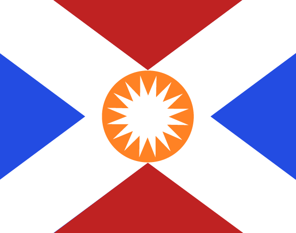

# A short description of an imaginary flag using a letter symbol

### Process

***Lukas Hunter, Imaginary flag with capitalized X, digital art made with illustrator.***

### Description

I decided to chose the letter “x”. The letter “x” has a centered proportion that is easily applicable on anything. Even on flags. On the picture, you can see a fictional flag with 
a bold white cross in the shape of an uppercase sans serif “x”. In the middle of the cross is an orange circle and inside the circle is a symbol of a sun. The sun symbol is made 
up of 16 points. The cross symbol is surrounded by four triangles, two triangles are blue and the other two are red. Blue white and red are common colours that are used on 
national flags with red symbolizing the blood that was spilled during certain country's revolution.
