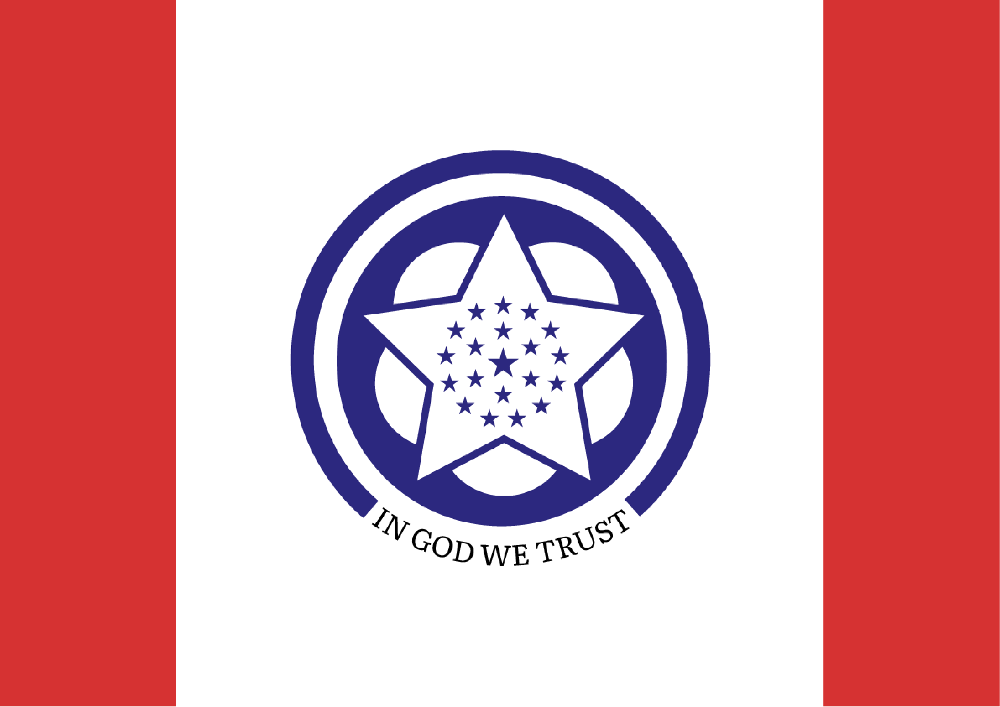
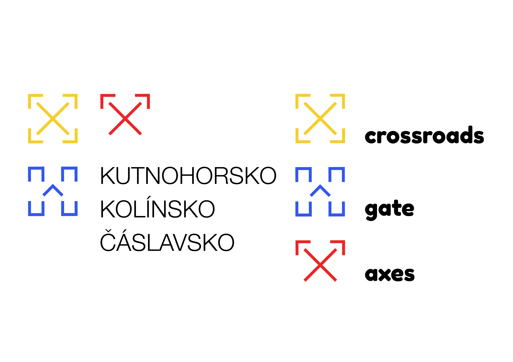
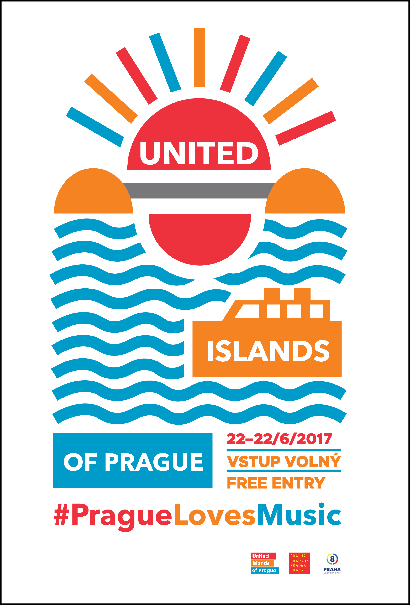

# My design story

***Introduction***

* Hello. My name is Lukas Hunter. Since I started to learn design, I always tried to be an optimistic designer, I believed that there is a way for anything. I like to solve
problems through the process of searching for new ideas on how to solve related issues. But what if you encounter a problem? What if you can't come up with something
creative? How can you make things look interesting and not just bland? Well, you put some flags into it! But who in their right mind would use flags? How did I come up with
this? Well, here is the full story.

***First there were maps...***

* When I was little, I discovered a School Atlas book sitting on my table. I started reading through the atlas book and it fascinated me like never before. I started to enjoy
looking at maps. I found maps very interesting. The idea that you could look at a certain country through simple visualization using lines was amazing to me. It's was as if
you had the whole world in your hands. When I looked at a certain country, I would be amazed by all the unique city names that country had. It made me want to learn more,
research more about the country. So I started looking on the internet. I started to excell in geography in school as well. *nerd alert!* 

***Then came the internet...***

* So I searched on the internet and started to learn more about a certain country's history and culture. Not in full detail, but enough to get an idea on how a country
functions and what are the main characteristics of it. But then I saw their flags. Before that, I've only seen flags as simple squares with some random shapes on them that
are being represented with a piece of cloth. But the truth is, they're something more. There's one thing that a flag and a map have in common. And that is, that they both
represent a country using symbols bordered by a rectanglurar shape, although in different ways. They both represent a country in a certain visual style and they both include
an information about a country. The information describes the country in a simple minimalist form. 

***And later came flags***

* The study of flags is called vexillology. I was introduced to this funny word in 2014 when I was searching the internet. Like most of people still to this day, I had no
idea such a word existed. And so it made me want to research more. I started looking into the symbolism of each country's flag. I learned that the most common colours on
flags are red, white and blue. Red symbolizes the blood that was spilled during a certain countries revolution, blue symbolizes the waters and white symbolizes peace. Perhaps
these colours are telling us a perception of how we want the world to be. Peaceful and rich in nature while soceties value their struggles in history. 

***My personal flag***

* Here is an example of my case study. The work is a personal flag that I created during my second semester at my graphic design school. The task was to create a unique
selfie that would describe our personality so I created my own personal flag that’s hanging on a flag pole in the sky. The colours yellow and black represent optimism and
pessimism. In the middle of the flag is a green eye representing the colours of my eyes. The two triangles represent the different views I take to seeing graphic design. The
triangle on the left side is a simple triangle in blue which is my personal favourite colour. On the right side is a more complex triangle using different colours. The whole
composition symbolizes how you can make creative ideas from simple things by visualising the idea through your own personal vision with your eyes and turn the idea into
something new and unique.

***5 rules of flag design***

* When I was making my flag, I tried to keep things clear and simple. Simplicity is key in the process of creating in graphic design. You want to make sure the stuff you make
is understandable whether it's in a small or big format. The same rules you know from graphic design can be applied to flag design as well. The 5 rules of flag design are:
Keep it simple. Use Meaningful Symbolism. Use 2 or 3 Basic Colors. No Lettering or Seals. Be Distinctive or Be Related. All these rules corelate with graphic and flag design.
And so I started to use these rules in my graphic work as well. 

***Flag redesign for the state of Mississippi***

* Here is an example of one of my flag designs. It is a flag redesign for the state of Mississippi. In spite of 2020 political climate, the state of Mississippi decided to
get a new design for their state through a public referendum replacing their old design with the confederate battle flag which to many symbolized years of slavery. I decided
to do my own take at a flag redesign. I tried to keep it as simple as possible while maintaing all the traditional colours of the previous state flag and adding a possible
symbolic replacement for the Confederate battle flag. The lettering had to be added since one of the rules of the competition was to include the phrase "In god we trust" in
our designs. The symbol is made up of a stylized magnolia flower reffering to Mississippi's common nickname as the Magnolia state. The 20 stars represent Mississippi's status
as the 20th state to join the Union. Around the symbol is a blue line representing the Mississippi river. 

***Logo for a tourist region***

* In 2019 I made a logo for a tourist ogranization called Kutnohorsko-Kolínsko-Čáslavsko. On the logo you can see three symbols representing the three small Czech cities that
encompass the tourist region. Each symbol is a unique characterization of the city. Kolín is symbolized by a stylized crossroads standing for it's nickname, Kutná Hora is
symbolized with a stylized axe standing for it’s famous silver mining in Medieval times and Čáslav is represented by a stylized historical gate symbolizing it's Medieval
gate. All of these symbols could be used separately as it's own standing thing. And that's how I started to project my knowledge of symbolism into graphic design. 

***Poster for United Islands of Prague***

* Here is another example of using symbolism in graphic design. The symbolism in vexillology was projected in this poster I made in high school for United Islands of Prague.
United Islands of Prague is a music festival, that takes place in Prague annually. On the poster, you can see a bridge inbetween two islands that symbolizes unity made with
simple geometric forms. Most flag designs use simple geometric forms since they can be easily remembered and applied on anyhthing. The colours of the poster are made up of
warm colours giving the poster a warm Summer feeling since the festival takes place in Summer. On the lower half of the poster you can see a stylized water with a ship in a
geometric form as well. 

***My business card***

* There are many other unique versions of flags that you can use in your design. For example, each naval flag symbolizes a letter in the alphabet, therefore are used as a
form of code to communicate with other ships. I decided to take those flags and incorporate them into my personal business card. The bussines card is made up of two layers.
The white layer can be pulled out to reveal the letters that the naval flags symbolize. And this is what it's all about. It's about having fun with flags and their unique
visual communication. With flags you can visualize your own story, your surroundings or yourself in a simple minimalist form. So remember, if you're having trouble, just use
flags! And if you ever want to talk, just email me with my business card.
