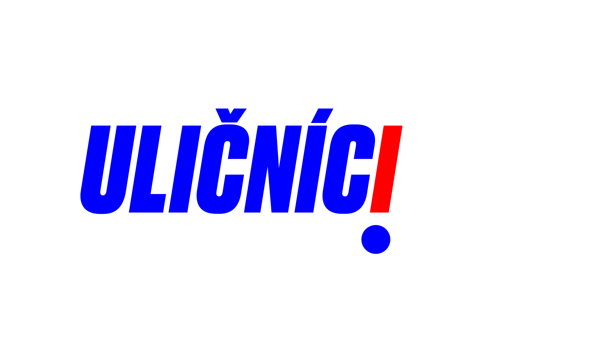

# A happening on Slovenian street 

___

*by Lukas Hunter*

*lukas.hunter@gmail.com*

6th of June, 2021

___

A special ocassion will be taking place on Slovenian street on 6th of June. Not like something you've ever seen before! A performance by the strange movement that calles itself
Uličníci *(Rascals)* will appear on Slovenian street next to the park on Cech Square. What is this movement and why are they doing this? The movement is touching the subject of
frivolous politics together with real problems in our streets, believe or not! The goal of this self proclaimed movement is to bring peace in the streets with these bizzare
performances. Will they achieve their "peace?" According to the movement, the upcoming peformance is the first of their many goals they want to achieve. According to the
movement's platform, which you can find on their social media and their web page, the goal of this performace is to get rid of Slovaks in Slovenian street so the names don't get
confused anymore! And apparently, thanks to this there will be more room for people to live. How smart! So that's the problem they"re focusing this performance on. Well I wish
the actors good luck with that. But let's take a deeper look on what's actually going to be happening.

All people living in Prague are welcome. The meeting will take place on Slovenian street on Saturday. There will be a speech adressing the performance that will introduce the
performance and the start of a new movement to the public. Once the speech is over, the perormance will begin. First, an actor will start running on Slovenian street as if he's
sprinting a race. After a brief moment, a second actor will show up running after him, which will terrify the runner into the finishing line at the end of the park. That's the
whole performance. It may seem simple, but the idea is very complex. It symbolizes the need to live and how there's not enough space for living, a huge problem for prague! Once
the performance is over there will be another one where a flag will be raised in a park symbolizing the end for the performance. During these performances people will be able to
take a badge or a t-shirt promoting the performamnce. So if you want a free t-shirt, feel free to come and enjoy these outlandish bizzare performances. 

# Thesis abstract

* For my thesis project I decided to create a visual style for my own made up frivolous political party. Political satire has it’s own history, that hasn’t been examined
properly and because of it’s small effectiveness amd influence in politics, it has mostly remained forgotten in our society. And so a majority of people can barely remember any
frivolous parties, despite there being already a few throughout political history. There is a tradition of humorouss way of seeing life, that is deeply engraved in Czech
mentality, starting with the Czech writer Jaroslav Hasek and so it makes sense to continue with that tradition in my thesis project.

* The aim of this thesis is to introduce political satire through my own personal movement and it's visual style. The tradition of humorous way of seeing life is deeply
engraved in Czech mentality, starting with the Czech writer Jaroslav Hasek and his party called The Party of Moderate Progress Within the Bounds of the Law, and so it makes
sense to continue with that tradition in through thesis project. 

* The main sources is a comprehensive research of other frivolous parties and a research of logos of existing poltitical movements and political and marketing literature. In my
thesis, I'm researching the way on how other frivolous parties functioned and communicated and from that I'm deducing my own project. I'm also woking with current geogpolitical
situations in the world that are crucial for the creation of my platform. In my theoretical part I'm taking a slight inspiration from other frivolous parties styles but
essentialy creating my own visual assets. 

* The goal is to create a visual design for my own political party. This party should be flexible in a way, where it can react to other political problems, the routes it can
take are many. The party can cooperate with other frivolous parties or it can turn into a real political party. 

Keywords: frivolousness, political party, visual style, movement

