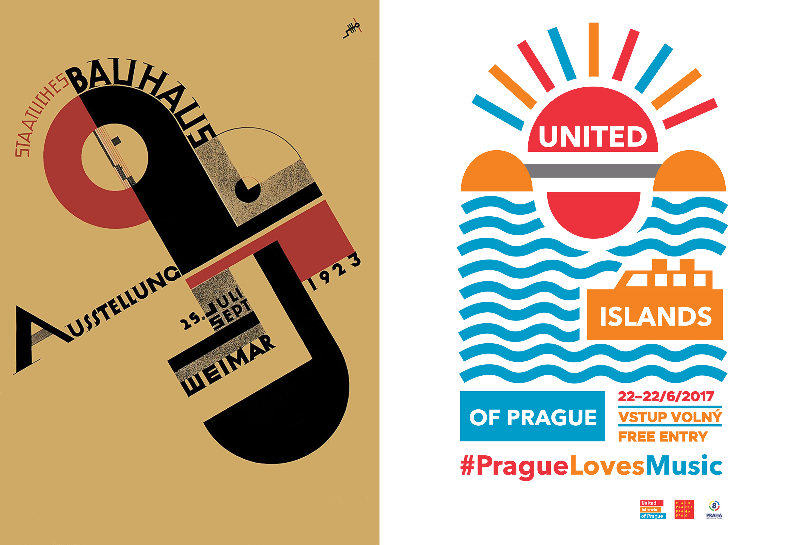

# *Chapter IV.*

* All my life I tried to avoid copying as much as possible. From my experience copying was seen as something negative: "Do you copy? You're a stealer!"  When I was a little boy,
copying was called *monkeying* in our Czech elementary school. That meant that if you were copying something from someone, you were a *copymonkey*, so like a copycat in English,
but using a Czech version of it. Your schoolmates would shame you for copying. In our class copying was a *taboo*.

* But what if you liked the stuff you saw your classmate do? I would get jealous and try to install something that I liked from his work into mine to make my work look better. I
tried to copy other peoples ideas in a very subtle way so nobody would notice. I would tweak something in my work to make it look a little better. But was it really copying?
What is the boundary between copying and inspiration? 

* To many, it's a matter of personal opinion, but when somebody is proud of their work, they get angry if someone copies even a tiny fragment from their work. But we shouldn't
see copying in a negative light. After all, seeing somebody being inspired by your work can mean that they like your idea. When you get older, you learn to acknowledge the
masters before you, for example the old masters in painting. Many artists were inspired by their previous peers. Vincent van Gogh liked Baroque Dutch masters and Japanese
paintings. Japanese art was seen as something new and fresh in the 19th century and inspired Van Gogh in many ways. He liked to copy works from the Japanese master Hiroshige to
further his style. 

***from left to right: Hiroshige, Plum Garden at Kameido, 1857 / Vincent Van Gogh, Flowering Plum Tree (after Hiroshige), 1887***

*  So we could go as far and say that without copying, Van Gogh wouldn't be able to expand his style of painting. Many other artists such as the Impressionists did the same
thing as well. You could say the pereception of how we view copying today started to shift when we entered the 20th century. With the Industrial Revolution on the way the
expansion of a market economy and rise of a new social class, everybody could gain something by claiming their property or work. Copying started to be seen as something negative
as if somebody is trying to steel your patented invention. 

* But copying was always part of our culture and there will be a moment when we will have to copy somebody else to expand our skills and knowledge. For example, when I was in
High School, I would try to learn to do my own original stuff in graphic design, but in some occasions it gets hard and there is no other way than to get inspired by previous
peers.

* So yes, copying was always part of our history and it's not something that will go away. Copying enriches our knowledge and helps us evolve and once we copy enough we can get
to our own unique style. It can also depend on our intentions. Copying can be done in a harmful way.like  when other people are exploiting other peoples ideas for their own
projects or their own personal gain. but like inviting someone to our own personal property that was owned by somebody before us and the person before them, we can change our
perception on copying as stop seeing it in a bad way. We can learn to undrstand it as  *working with previous sources* instead. 

***MY PERSONAL EXPERIENCE***

* From my personal experience, I always tried to copy as less as possible, but you shouldn't feel ashamed of it. Copying is learning and in the digital age, we're all copying
something, whether it's a visual style or a downloaded font. In high school, for one of my posters, I would be inspired by the shapes produced by Bauhaus. True, it wasn't the
same picture, but the idea is similar — working with shapes to produce a composition. I used Bauhaus works as inspiration. Of course, there are countless other designs inspired
by the same source.

***from left to right: Joost Schmidt, Poster for the Bauhausaustellung, 1923 / Poster for United Islands of Prague made by me, 2017***

* As for another example of direct copying, in one of our workshops, we invited a famous Czech graphic designer Pavel Fuksa to one of our workshops. I iked Pavel Fuksa's style
and tried to copy it myself. His style contains simple geometric style shapes inspired by Czechoslovak design in the 80s. However, even the great master Pavel Fuksa himself got
inspired from somebody else. So don't be afraid to experiment with other styles and other people's works!

***from left to right: Pavel Fuksa, Series of presidential postage stamps, 2018 / Postage stamp made by me, 2020***
